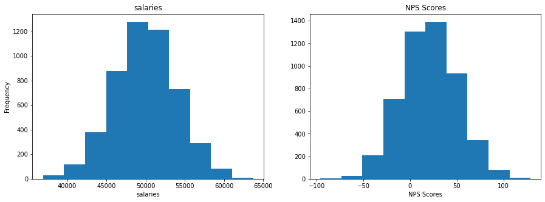
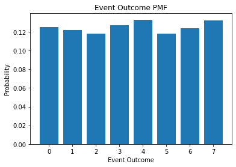
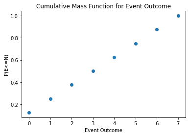

# Objectives
YW
* scrape a website for relevant information, store that information to a dataframe and save that dataframe as a csv file
* load in a dataframe and do the following
    * calculate the zscores of a given column
    * calculate the zscores of a point from a given column in the dataframe
    * calculate and plot the pmf and cdf of another column

# Part 1 - Webscraping
* use the following url scrape the first page of results
* for each item get the name of the item
* store the names to a dataframe and save that dataframe to csv then display
    * store the dataframe in the `data` folder in the repo
    * name the file `part1.csv` and make sure that when you write it you set `index=False`
* the head of the dataframe

* it should match the following


```python
from bs4 import BeautifulSoup
import pandas as pd
import requests
```


```python
url = "https://www.petsmart.com/dog/treats/dental-treats/#page_name=flyout&category=dog&cta=dentaltreat"
```


```python
html_page = requests.get(url)
soup = BeautifulSoup(html_page.content, 'html.parser')
```


```python
filter_sidebar = soup.find("div", class_="filter-menu-bar sidebar-filter")
```


```python
treats_container = filter_sidebar.nextSibling.nextSibling
```


```python
# scrape the names of the items on the webpage above
items = treats_container.findAll('a')
items[0:6]
```


    [<a class="name-link" data-lid="Greenies Regular Dental Dog Treats" data-link-type="o" data-lpos="product-list" data-master="product-click" href="/dog/treats/dental-treats/greenies-regular-dental-dog-treats-4750.html?cgid=100269" title="Greenies Regular Dental Dog Treats">
     <div class="product-tile" data-itemid="4750" id="1806d42c4c06fbff2c47b5b2e9">
     <div class="product-tile-badge">
     </div>
     <div class="product-image-wrapper">
     <div class="product-image">
     
     </img></div>
     <meta content="https://s7d2.scene7.com/is/image/PetSmart/5265958?$sclp-prd-main_small$" property="og:image">
     <meta content="https://s7d2.scene7.com/is/image/PetSmart/5265958?$sclp-prd-main_small$" name="twitter:image">
     <div class="product-tile-flavours">
     <div class="product-flavour-text">
     6
     Sizes
     </div>
     </div>
     </meta></meta></div>
     <div>
     <div class="product-name">
     <h3>Greenies Regular Dental Dog Treats</h3>
     </div>
     <div class="product-pricing">
     <span itemprop="priceCurrency"><input name="priceCurrencyVal" type="hidden" value="USD"/></span>
     <div class="product-price">
     <span class="price-regular"><span class="sr-only">Old Price</span>
     $4.99
     -
     54.99
     </span>
     <div class="price-sales tile-autoship">
     $4.74
     - 52.24
     <div class="price-text">5% off Auto Ship</div>
     </div>
     </div>
     </div>
     <input class="bv-enabled" type="hidden" value="true">
     <div id="bv-product-tile-4750"><div id="BVRRInlineRating-4750"></div></div>
     <script language="javascript" type="text/javascript">
     		if(typeof bvProdIds == "undefined") {
     			bvProdIds = new Array();
     		}
     		bvProdIds.push("4750");
     		</script>
     <div class="product-promo">
     <div class="promotional-message">
     <p>Sign In &amp; Enjoy Free Shipping Over $49</p>
     </div>
     </div>
     </input></div>
     </div>
     </a>,
     <a class="name-link" data-lid="Greenies Teenie Dental Dog Treats" data-link-type="o" data-lpos="product-list" data-master="product-click" href="/dog/treats/dental-treats/greenies-teenie-dental-dog-treats-4735.html?cgid=100269" title="Greenies Teenie Dental Dog Treats">
     <div class="product-tile" data-itemid="4735" id="cbe0a9c33b7ba8cd5bca02562f">
     <div class="product-tile-badge">
     </div>
     <div class="product-image-wrapper">
     <div class="product-image">
     
     </img></div>
     <meta content="https://s7d2.scene7.com/is/image/PetSmart/5265957?$sclp-prd-main_small$" property="og:image">
     <meta content="https://s7d2.scene7.com/is/image/PetSmart/5265957?$sclp-prd-main_small$" name="twitter:image"/>
     <div class="product-tile-flavours">
     <div class="product-flavour-text">
     6
     Sizes
     </div>
     </div>
     </meta></div>
     <div>
     <div class="product-name">
     <h3>Greenies Teenie Dental Dog Treats</h3>
     </div>
     <div class="product-pricing">
     <span itemprop="priceCurrency"><input name="priceCurrencyVal" type="hidden" value="USD"/></span>
     <div class="product-price">
     <span class="price-regular"><span class="sr-only">Old Price</span>
     $4.99
     -
     54.99
     </span>
     <div class="price-sales tile-autoship">
     $4.74
     - 52.24
     <div class="price-text">5% off Auto Ship</div>
     </div>
     </div>
     </div>
     <input class="bv-enabled" type="hidden" value="true">
     <div id="bv-product-tile-4735"><div id="BVRRInlineRating-4735"></div></div>
     <script language="javascript" type="text/javascript">
     		if(typeof bvProdIds == "undefined") {
     			bvProdIds = new Array();
     		}
     		bvProdIds.push("4735");
     		</script>
     <div class="product-promo">
     <div class="promotional-message">
     <p>Sign In &amp; Enjoy Free Shipping Over $49</p>
     </div>
     </div>
     </input></div>
     </div>
     </a>,
     <a class="name-link" data-lid="Greenies Large Dental Dog Treats" data-link-type="o" data-lpos="product-list" data-master="product-click" href="/dog/treats/dental-treats/greenies-large-dental-dog-treats-4742.html?cgid=100269" title="Greenies Large Dental Dog Treats">
     <div class="product-tile" data-itemid="4742" id="3b2ac471fe7f0ace84de110a57">
     <div class="product-tile-badge">
     </div>
     <div class="product-image-wrapper">
     <div class="product-image">
     
     </img></div>
     <meta content="https://s7d2.scene7.com/is/image/PetSmart/5203879?$sclp-prd-main_small$" property="og:image"/>
     <meta content="https://s7d2.scene7.com/is/image/PetSmart/5203879?$sclp-prd-main_small$" name="twitter:image"/>
     <div class="product-tile-flavours">
     <div class="product-flavour-text">
     5
     Sizes
     </div>
     </div>
     </div>
     <div>
     <div class="product-name">
     <h3>Greenies Large Dental Dog Treats</h3>
     </div>
     <div class="product-pricing">
     <span itemprop="priceCurrency"><input name="priceCurrencyVal" type="hidden" value="USD"/></span>
     <div class="product-price">
     <span class="price-regular"><span class="sr-only">Old Price</span>
     $9.99
     -
     54.99
     </span>
     <div class="price-sales tile-autoship">
     $9.49
     - 52.24
     <div class="price-text">5% off Auto Ship</div>
     </div>
     </div>
     </div>
     <input class="bv-enabled" type="hidden" value="true">
     <div id="bv-product-tile-4742"><div id="BVRRInlineRating-4742"></div></div>
     <script language="javascript" type="text/javascript">
     		if(typeof bvProdIds == "undefined") {
     			bvProdIds = new Array();
     		}
     		bvProdIds.push("4742");
     		</script>
     <div class="product-promo">
     <div class="promotional-message">
     <p>Sign In &amp; Enjoy Free Shipping Over $49</p>
     </div>
     </div>
     </input></div>
     </div>
     </a>,
     <a class="name-link" data-lid="Authority® Dental &amp; DHA Stick Puppy Treats Parsley Mint - Gluten Free, Grain Free" data-link-type="o" data-lpos="product-list" data-master="product-click" href="/dog/treats/dental-treats/authority-dental-and-dha-stick-puppy-treats-parsley-mint---gluten-free-grain-free-51047.html?cgid=100269" title="Authority® Dental &amp; DHA Stick Puppy Treats Parsley Mint - Gluten Free, Grain Free">
     <div class="product-tile" data-itemid="51047" id="081e15fe4028eb1aad91532611">
     <div class="product-tile-badge">
     </div>
     <div class="product-image-wrapper">
     <div class="product-image">
     
     </img></div>
     <meta content="https://s7d2.scene7.com/is/image/PetSmart/5283218?$sclp-prd-main_large$" property="og:image"/>
     <meta content="https://s7d2.scene7.com/is/image/PetSmart/5283218?$sclp-prd-main_large$" name="twitter:image"/>
     <div class="product-tile-flavours">
     </div>
     </div>
     <div>
     <div class="product-name">
     <h3>Authority<sup>®</sup> Dental &amp; DHA Stick Puppy Treats Parsley Mint - Gluten Free, Grain Free</h3>
     </div>
     <div class="product-pricing">
     <span itemprop="priceCurrency"><input name="priceCurrencyVal" type="hidden" value="USD"/></span>
     <div class="product-price">
     <span class="price-regular"><span class="sr-only">Old Price</span>
     $3.99
     </span>
     <div class="price-sales tile-autoship">
     $3.79
     <div class="price-text">5% off Auto Ship</div>
     </div>
     </div>
     </div>
     <input class="bv-enabled" type="hidden" value="true">
     <div id="bv-product-tile-51047"><div id="BVRRInlineRating-51047"></div></div>
     <script language="javascript" type="text/javascript">
     		if(typeof bvProdIds == "undefined") {
     			bvProdIds = new Array();
     		}
     		bvProdIds.push("51047");
     		</script>
     <div class="product-promo">
     <div class="promotional-message">
     <p>Buy 2, Get the 3rd 50% Off Dog Treats</p>
     </div>
     <div class="promotional-message">
     <p>Sign In &amp; Enjoy Free Shipping Over $49</p>
     </div>
     </div>
     </input></div>
     </div>
     </a>,
     <a class="name-link" data-lid="Greenies Petite Dental Dog Treats" data-link-type="o" data-lpos="product-list" data-master="product-click" href="/dog/treats/dental-treats/greenies-petite-dental-dog-treats-4743.html?cgid=100269" title="Greenies Petite Dental Dog Treats">
     <div class="product-tile" data-itemid="4743" id="e4dc249bd9a6dfad0fc80c4008">
     <div class="product-tile-badge">
     </div>
     <div class="product-image-wrapper">
     <div class="product-image">
     
     </img></div>
     <meta content="https://s7d2.scene7.com/is/image/PetSmart/5265959?$sclp-prd-main_large$" property="og:image"/>
     <meta content="https://s7d2.scene7.com/is/image/PetSmart/5265959?$sclp-prd-main_large$" name="twitter:image"/>
     <div class="product-tile-flavours">
     <div class="product-flavour-text">
     6
     Sizes
     </div>
     </div>
     </div>
     <div>
     <div class="product-name">
     <h3>Greenies Petite Dental Dog Treats</h3>
     </div>
     <div class="product-pricing">
     <span itemprop="priceCurrency"><input name="priceCurrencyVal" type="hidden" value="USD"/></span>
     <div class="product-price">
     <span class="price-regular"><span class="sr-only">Old Price</span>
     $4.99
     -
     54.99
     </span>
     <div class="price-sales tile-autoship">
     $4.74
     - 52.24
     <div class="price-text">5% off Auto Ship</div>
     </div>
     </div>
     </div>
     <input class="bv-enabled" type="hidden" value="true">
     <div id="bv-product-tile-4743"><div id="BVRRInlineRating-4743"></div></div>
     <script language="javascript" type="text/javascript">
     		if(typeof bvProdIds == "undefined") {
     			bvProdIds = new Array();
     		}
     		bvProdIds.push("4743");
     		</script>
     <div class="product-promo">
     <div class="promotional-message">
     <p>Sign In &amp; Enjoy Free Shipping Over $49</p>
     </div>
     </div>
     </input></div>
     </div>
     </a>,
     <a class="name-link" data-lid="WHIMZEES Brushzees Dental Dog Treat - Natural, Grain Free, 1 Count" data-link-type="o" data-lpos="product-list" data-master="product-click" href="/dog/treats/dental-treats/whimzees-brushzees-dental-dog-treat---natural-grain-free-1-count-60907.html?cgid=100269" title="WHIMZEES Brushzees Dental Dog Treat - Natural, Grain Free, 1 Count">
     <div class="product-tile" data-itemid="60907" id="753c49f14e29c3a1d56fbc1030">
     <div class="product-tile-badge">
     <div class="text-badge">New</div>
     </div>
     <div class="product-image-wrapper">
     <div class="product-image">
     
     </img></div>
     <meta content="https://s7d2.scene7.com/is/image/PetSmart/5275113?$sclp-prd-main_small$" property="og:image"/>
     <meta content="https://s7d2.scene7.com/is/image/PetSmart/5275113?$sclp-prd-main_small$" name="twitter:image"/>
     <div class="product-tile-flavours">
     <div class="product-flavour-text">
     4
     Sizes
     </div>
     </div>
     </div>
     <div>
     <div class="product-name">
     <h3>WHIMZEES Brushzees Dental Dog Treat - Natural, Grain Free, 1 Count</h3>
     </div>
     <div class="product-pricing">
     <span itemprop="priceCurrency"><input name="priceCurrencyVal" type="hidden" value="USD"/></span>
     <div class="product-price">
     <span class="price-sales"><span class="sr-only">Discounted Price</span>
     $0.49
     -
     4.19
     </span>
     <span class="price-standard"><span class="sr-only">Old Price</span>
     $0.49
     -
     4.99
     </span>
     </div>
     </div>
     <input class="bv-enabled" type="hidden" value="true">
     <div id="bv-product-tile-60907"><div id="BVRRInlineRating-60907"></div></div>
     <script language="javascript" type="text/javascript">
     		if(typeof bvProdIds == "undefined") {
     			bvProdIds = new Array();
     		}
     		bvProdIds.push("60907");
     		</script>
     </input></div>
     </div>
     </a>]


```python
items[0].attrs['title']
```


    'Greenies Regular Dental Dog Treats'


```python
item_titles = [i.attrs['title'] for i in items]
print(len(item_titles), item_titles[:5])
```

    38 ['Greenies Regular Dental Dog Treats', 'Greenies Teenie Dental Dog Treats', 'Greenies Large Dental Dog Treats', 'Authority® Dental & DHA Stick Puppy Treats Parsley Mint - Gluten Free, Grain Free', 'Greenies Petite Dental Dog Treats']


```python
item_names = []
for i in item_titles:
    item_names.append(i)
```


```python
del item_names[-1]
```


```python
del item_names[-2]
```


```python
item_names
```


    ['Greenies Regular Dental Dog Treats',
     'Greenies Teenie Dental Dog Treats',
     'Greenies Large Dental Dog Treats',
     'Authority® Dental & DHA Stick Puppy Treats Parsley Mint - Gluten Free, Grain Free',
     'Greenies Petite Dental Dog Treats',
     'WHIMZEES Brushzees Dental Dog Treat - Natural, Grain Free, 1 Count',
     'Pedigree Dentastix Triple Action Dental Dog Treats - Variety Pack',
     'Pedigree Dentastix Large Dog Treats',
     'Pedigree Dentastix Large Dog Sticks',
     'Authority® Dental & DHA Rings Puppy Treats Parsley Mint - Gluten Free, Grain Free',
     'WHIMZEES Veggie Sausage Dog Dental Treat - Natural, 1 Count',
     'Pedigree Dentastix Small/Medium Dog Sticks',
     'Greenies Teenie Dog Dental Treats - Blueberry',
     'WHIMZEES Variety Value Box Dental Dog Treat - Natural, Grain Free',
     'Virbac® C.E.T.® VeggieDent® Tartar Control Dog Chews',
     'Pedigree Dentastix Triple Action Small Dog Treats - Fresh',
     'Authority Dental & Multivitamin Large Dog Treats Parsley Mint - Gluten Free, Grain Free',
     'Yummy Combs® Ingenious Flossing Dog Dental Treat - 1 Count',
     'Pedigree Dentastix Large Dog Sticks',
     'Pedigree Dentastix Mini Dog Sticks',
     'Ark Naturals® Brushless Toothpaste 4-in-1 Small Dog Dental Chews - 8-20 lbs.',
     'Authority® Dental & Multivitamin Medium Dog Treats Parsley Mint - Gluten Free, Grain Free',
     'Ark Naturals® Brushless Toothpaste 4-in-1 Large Dog Dental Chews - 40+ lbs.',
     'Milk-Bone Brushing Chews Large Dental Dog Treats',
     'Milk-Bone Brushing Chew Mini Dental Dog Treats',
     'Authority Dental & Multivitamin Small Dog Treats Parsley Mint - Gluten Free, Grain Free',
     'WHIMZEES Stix Dental Dog Treat - Natural, 1 Count',
     'Greenies Teenie Dental Dog Treats - Fresh',
     'Greenies Regular Dog Dental Treats - Blueberry',
     'Authority Dental & Multivitamin Parsley Mint Dog Treat Bites - Gluten Free, Grain Free',
     'WHIMZEES Hedgehog Dental Dog Treat - Natural, 1 Count',
     'WHIMZEES Alligator Dental Dog Treat - Natural, 1 Count',
     'Pedigree Dentastix Dual Flavor Mini Dental Dog Treats',
     'Yummy Combs® Ingenious Flossing Dog Dental Treats - Chicken']


```python
# load the data into a dataframe file
import pandas as pd
df = pd.DataFrame([item_names]).transpose()
df.columns = ['Dental Treats']
```


<div>
<style scoped>
    .dataframe tbody tr th:only-of-type {
        vertical-align: middle;
    }

    .dataframe tbody tr th {
        vertical-align: top;
    }

    .dataframe thead th {
        text-align: right;
    }
</style>
<table border="1" class="dataframe">
  <thead>
    <tr style="text-align: right;">
      <th></th>
      <th>Dental Treats</th>
    </tr>
  </thead>
  <tbody>
    <tr>
      <th>0</th>
      <td>Greenies Regular Dental Dog Treats</td>
    </tr>
    <tr>
      <th>1</th>
      <td>Greenies Teenie Dental Dog Treats</td>
    </tr>
    <tr>
      <th>2</th>
      <td>Greenies Large Dental Dog Treats</td>
    </tr>
    <tr>
      <th>3</th>
      <td>Authority® Dental &amp; DHA Stick Puppy Treats Par...</td>
    </tr>
    <tr>
      <th>4</th>
      <td>Greenies Petite Dental Dog Treats</td>
    </tr>
  </tbody>
</table>
</div>


```python
# save the data as a csv file
df.to_csv('data/part1.csv', index=False)
```


```python
# display df.head()
df.head()
```


<div>
<style scoped>
    .dataframe tbody tr th:only-of-type {
        vertical-align: middle;
    }

    .dataframe tbody tr th {
        vertical-align: top;
    }

    .dataframe thead th {
        text-align: right;
    }
</style>
<table border="1" class="dataframe">
  <thead>
    <tr style="text-align: right;">
      <th></th>
      <th>Dental Treats</th>
    </tr>
  </thead>
  <tbody>
    <tr>
      <th>0</th>
      <td>Greenies Regular Dental Dog Treats</td>
    </tr>
    <tr>
      <th>1</th>
      <td>Greenies Teenie Dental Dog Treats</td>
    </tr>
    <tr>
      <th>2</th>
      <td>Greenies Large Dental Dog Treats</td>
    </tr>
    <tr>
      <th>3</th>
      <td>Authority® Dental &amp; DHA Stick Puppy Treats Par...</td>
    </tr>
    <tr>
      <th>4</th>
      <td>Greenies Petite Dental Dog Treats</td>
    </tr>
  </tbody>
</table>
</div>


# Part 2

load in the csv file located in the `data` folder called `part2.csv`

create a function that calculates the zscores of an array

then calculate the zscores for each column in part2.csv and add them as columns

See below for final result


```python
# load in the dataframe, notice it only contains columns salaries, NPS Score, eventOutcome
df_2 = pd.read_csv('data/part2.csv')
df_2.head()
```


<div>
<style scoped>
    .dataframe tbody tr th:only-of-type {
        vertical-align: middle;
    }

    .dataframe tbody tr th {
        vertical-align: top;
    }

    .dataframe thead th {
        text-align: right;
    }
</style>
<table border="1" class="dataframe">
  <thead>
    <tr style="text-align: right;">
      <th></th>
      <th>salaries</th>
      <th>NPS Score</th>
      <th>eventOutcome</th>
    </tr>
  </thead>
  <tbody>
    <tr>
      <th>0</th>
      <td>44112.0</td>
      <td>-7.0</td>
      <td>1</td>
    </tr>
    <tr>
      <th>1</th>
      <td>46777.0</td>
      <td>-12.0</td>
      <td>2</td>
    </tr>
    <tr>
      <th>2</th>
      <td>50013.0</td>
      <td>50.0</td>
      <td>5</td>
    </tr>
    <tr>
      <th>3</th>
      <td>48983.0</td>
      <td>-13.0</td>
      <td>0</td>
    </tr>
    <tr>
      <th>4</th>
      <td>50751.0</td>
      <td>-11.0</td>
      <td>6</td>
    </tr>
  </tbody>
</table>
</div>


```python
salary_mean = df_2['salaries'].mean()
salary_std = df_2['salaries'].std()

nps_mean =  df_2['NPS Score'].mean()
nps_std =  df_2['NPS Score'].std()

event_mean = df_2['eventOutcome'].mean()
event_std = df_2['eventOutcome'].std()

print(salary_mean, salary_std)
print(nps_mean, nps_std)
print(event_mean, event_std)
```

    49953.2898 4000.459734609712
    20.327 29.913907123073603
    3.5356 2.2984754159763314


```python
def zscores(arr):
    """
    write a function that calculates 
    the zscores of a numpy arr, arr.
    """
    for index in df_2:
        z = (len(df_2[index]) - np.mean(df_2[index])) / np.std(df_2[index])
        print(z)
        
        
zscores(df_2)
```

    -11.238154808669226
    166.48346942837742
    2174.034182252448


```python
# calculate the zscore for each column and store them as a new column with the names used above
df_2['salaries_zscores'] = zscores(df_2['salaries_zscores'])
df_2['NPS score_zscores'] = zscores(df_2['NPS score_zscores'])
df_2['eventOutcome_zscores'] = zscores(df_2['eventOutcome_zscores'])
```

# Part 3 
plot 'salaries' and 'NPS Score' on a subplot (1 row 2 columns) 
then repeat this for the zscores

see image below for reference


```python
import matplotlib.pyplot as plt
%matplotlib inline
```


```python
# plot for raw salaries and NPS Score data goes here
fig = plt.figure(figsize=(15,5))


ax1 = fig.add_subplot(121)
ax2 = fig.add_subplot(122)

ax1.hist(df_2['salaries'])
ax2.hist(df_2['NPS Score'])

ax1.set_title ("salaries");
ax2.set_title ("NPS Scores");

ax1.set_ylabel('Frequency')
ax1.set_xlabel('salaries')
ax2.set_xlabel('NPS Scores')
```


    Text(0.5, 0, 'NPS Scores')





```python
# plot for zscores for salaries and NPS Score data goes here
```

# Part 4 - PMF
using the column 'eventOutcomes'

create a PMF and plot the PMF as a bar chart

See image below for referenc


```python
import collections
counter = collections.Counter(df_2['eventOutcome'])
print(counter)
print(len(df_2['eventOutcome']))
```

    Counter({4: 666, 7: 661, 3: 636, 0: 624, 6: 622, 1: 608, 2: 592, 5: 591})
    5000


```python
pmf = []

for key,val in counter.items():
    pmf.append(round(val/5000, 3))
    
print(counter.keys(), pmf)

plt.bar(counter.keys(), pmf);
plt.title("Event Outcome PMF");
plt.xlabel('Event Outcome')
plt.ylabel('Probability')
```

    dict_keys([1, 2, 5, 0, 6, 4, 3, 7]) [0.122, 0.118, 0.118, 0.125, 0.124, 0.133, 0.127, 0.132]


    Text(0, 0.5, 'Probability')





# Part 5 - CDF
plot the CDF of Event Outcomes as a scatter plot using the information above

See image below for reference 


```python
sample = list(counter.keys())
hist = np.histogram(sample, bins = 8, range=(0,8), normed=True)
plt.scatter(hist[1][:-1], np.cumsum(hist[0]))
plt.title('Cumulative Mass Function for Event Outcome')
plt.xlabel('Event Outcome')
plt.ylabel('P(E<=N)')
```

    /Users/Gabby/opt/anaconda3/envs/learn-env/lib/python3.6/site-packages/ipykernel_launcher.py:2: VisibleDeprecationWarning: Passing `normed=True` on non-uniform bins has always been broken, and computes neither the probability density function nor the probability mass function. The result is only correct if the bins are uniform, when density=True will produce the same result anyway. The argument will be removed in a future version of numpy.
      


    Text(0, 0.5, 'P(E<=N)')





# Level Up:
* using np.where find salaries with zscores <= -2.0

* calculate the skewness and kurtosis for the NPS Score column

* plot the pdf and cdf of a given distribution


```python
# find salaries with zscores <= 2.0 
```


```python
# calculate skewness and kurtosis of NPS Score column
```

# Plotting a pdf and cdf of a normal distribution
A survey is taken that finds that students send an mean average of 80 DMs a day with a standard deviation of 6 DMS. 


```python
# plot the pdf and cdf of this normal distribution. level up if you can do it in subplots
```


```python
# what is the probability of drawing a student that sends at least 82 DMs a day?
```

A second survey is taken at another bootcamp that shows that students send a mean average of
80 DMs a day, but they have a standard deviation of 9 DMS.  


```python
# What is the difference in the probability of finding a student that sends, at most, 65 DMs a day? 
```

# run the cell below to convert your notebook to a README for assessment


```python
!jupyter nbconvert --to markdown assessment.ipynb && mv assessment.md README.md
```
